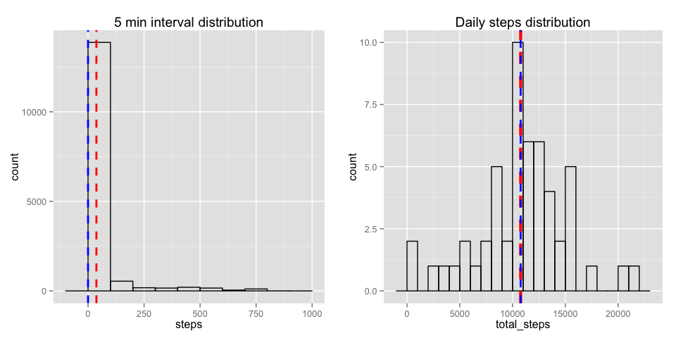
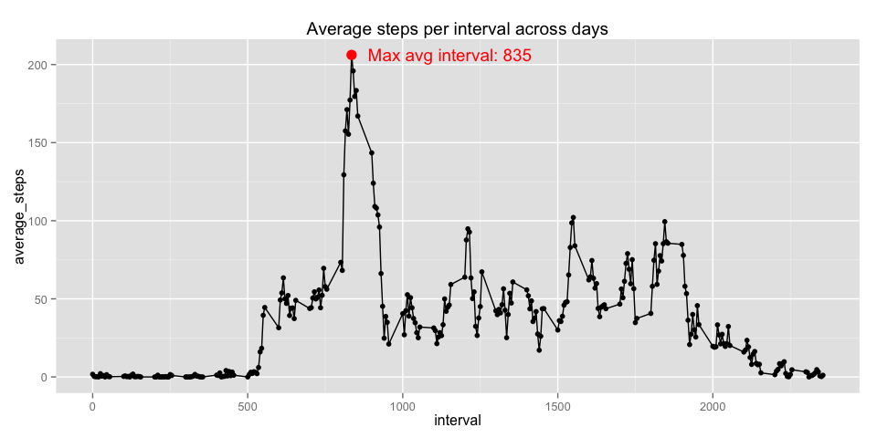
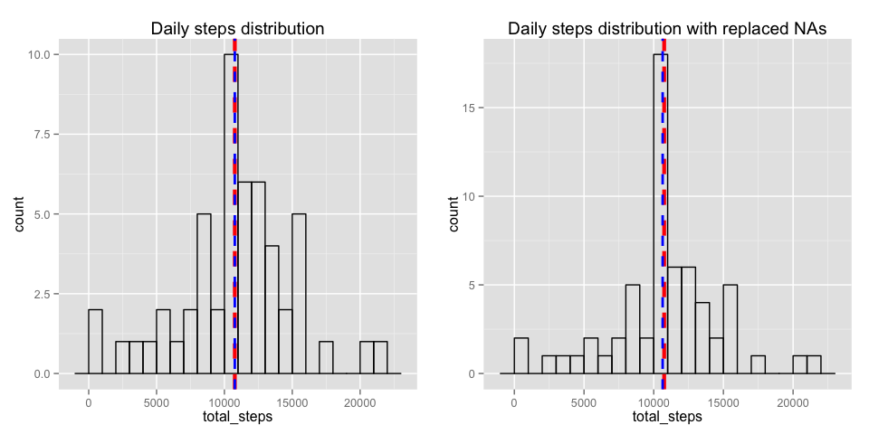
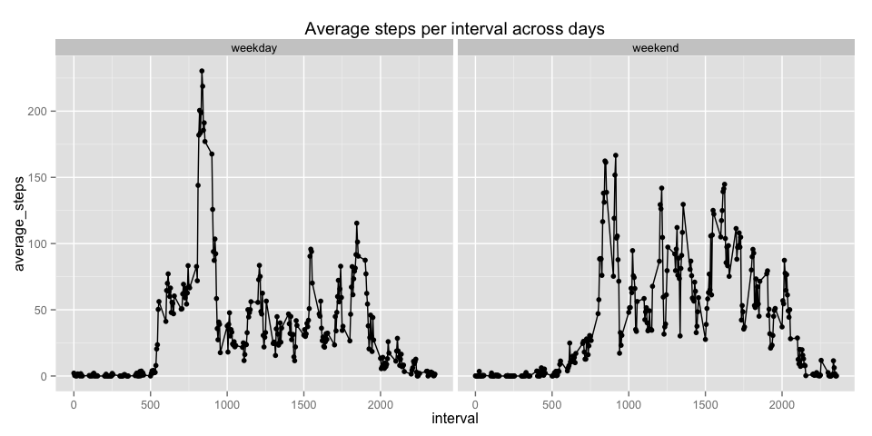

# Reproducible Research: Peer Assessment 1
## Required libraries 
The following libraries are required to perform the analysis over the
activity monitoring dataset.

```r
library(dplyr)
library(ggplot2)
library(gridExtra)
library(RColorBrewer)
library(zoo)
```

## Loading and preprocessing the data
Data required to run the analysis can be found the `activity.zip` file included
in this repository. It is just a matter of unzipping and creating a suitable
data frame for the analysis. 

As analysis involves grouping by date, the `date` column is converted to a `Date`
type. 

```r
unzip("activity.zip", exdir="data")

act_data <- tbl_df(read.csv("./data/activity.csv", header=TRUE))
act_data$date <- as.Date(act_data$date)
```

## What is mean total number of steps taken per day?
For the first part, as we are ignoring `NA` values, we subset a data frame 
containing the complete cases only. This is easily accomplished with the
use of the `filter()` function from `dplyr` package.


```r
without_na <- act_data %>%
    filter(complete.cases(.))
```

To get a nice view of the data in the dataset we plot 2 histograms: 

#### Distribution of steps taken in the 5 minute intervals

As shown in the plot below, most of the intervals are **0 steps** counts, which  reflect sleep, sitting time. We construct this plot by simply doing a histogram 
of the steps taken.


```r
interval_dist <- ggplot(without_na, aes(x=steps)) +
    geom_histogram(binwidth=100, fill=NA, color="black") +
    geom_vline(data=without_na, 
               aes(xintercept=mean(steps)), 
               color="red",
               linetype="dashed", 
               size=1,
               show_guide=TRUE) +
    geom_vline(data=without_na, 
               aes(xintercept=median(steps)), 
               color="blue",
               linetype="dashed",
               size=1,
               show_guide=TRUE) +
    labs(title="5 min interval distribution") 
```

#### Distribution of total steps taken per day

We then group intervals by date, and summarize the total amount of steps taken in 
a day.

The `red line` presents the `mean` and the `blue line` the `median`.


```r
by_day <- group_by(without_na, date)
daily_overview <- by_day %>%
    summarise(total_steps = sum(steps))

daily_steps <- ggplot(daily_overview, aes(x=total_steps)) +    
    geom_histogram(binwidth=1000, fill=NA, color="black") +
    geom_vline(data=daily_overview, 
               aes(xintercept=mean(total_steps)), 
               color="red",
               linetype="dashed", 
               size=1.5,
               show_guide=TRUE) +
    geom_vline(data=daily_overview, 
               aes(xintercept=median(total_steps)), 
               color="blue",
               linetype="dashed",
               size=1,
               show_guide=TRUE) +
    labs(title="Daily steps distribution")

grid.arrange(interval_dist, daily_steps, ncol=2)
```

 

## What is the average daily activity pattern?
A plot of the averge steps taken per interval across all days can be created
by grouping the dataset by interval and summarizing the `mean()`. The average
with the maximum average across days is marked in red.


```r
by_interval <- group_by(without_na, interval)
interval_avg <- by_interval %>%
    summarise(average_steps = mean(steps))

# Subset the row with the max average
most_active <- filter(interval_avg, average_steps == max(average_steps))

# Create the plot
ggplot(interval_avg, aes(x=interval, y=average_steps)) +
    geom_line() + geom_point() +
    geom_point(data=most_active, color="red", size=4) +
    annotate("text", label=paste("Max avg interval:", most_active$interval), 
               x=most_active$interval, 
               y=most_active$average_steps, 
               size=5,
               hjust=-0.1,
               color="red") +
    labs(title="Average steps per interval across days")
```

 


## Imputing missing values
The amount of missing values in the dataset can be calculated as follows:


```r
num_obs = nrow(act_data)
num_NA = num_obs - sum(complete.cases(act_data))
data.frame(Observations=num_obs, NAs=num_NA, Perc_NA=(num_NA*100/num_obs))
```

```
##   Observations  NAs  Perc_NA
## 1        17568 2304 13.11475
```

In order to replace the `NA` values, we calculate the `interval` averge across
all dataset and use it's integer value.  We do this by adding a new column to the dataframe using the
`apply()` function.


```r
# Group by interval and calculate the interval average
by_interval <- group_by(act_data, interval)
int_avg <- by_interval %>%
    summarise(local_avg = mean(steps, na.rm = TRUE))

resolve_avg <- function(n) {
    if(!is.na(n['steps'])){
        return(n['steps'])
    }
    else {
       return(as.integer(int_avg[int_avg$interval == n['interval'], ]$local_avg))
    }
}
act_data$steps_fill <- apply(act_data[,c("interval", "steps")], 1, resolve_avg)
head(act_data, 5)
```

```
## Source: local data frame [5 x 4]
## 
##   steps       date interval steps_fill
## 1    NA 2012-10-01        0          1
## 2    NA 2012-10-01        5          0
## 3    NA 2012-10-01       10          0
## 4    NA 2012-10-01       15          0
## 5    NA 2012-10-01       20          0
```

We now compare the values between the two datasets, with and without NAs.


```r
filled_by_day <- group_by(act_data, date)
daily_overview2 <- filled_by_day %>%
    summarise(total_steps = sum(steps_fill))

daily_steps2 <- ggplot(daily_overview2, aes(x=total_steps)) +    
    geom_histogram(binwidth=1000, fill=NA, color="black") +
    geom_vline(data=daily_overview2, 
               aes(xintercept=mean(total_steps)), 
               color="red",
               linetype="dashed", 
               size=1.5,
               show_guide=TRUE) +
    geom_vline(data=daily_overview2, 
               aes(xintercept=median(total_steps)), 
               color="blue",
               linetype="dashed",
               size=1,
               show_guide=TRUE) +
    labs(title="Daily steps distribution with replaced NAs")

grid.arrange(daily_steps, daily_steps2, ncol=2)
```

 


## Are there differences in activity patterns between weekdays and weekends?

We use `sapply()` function to add one more column to the data set. We then compute
the grouped averages and plot them.


```r
kind_of_day <- function(l){
    if(weekdays(l, abbreviate=TRUE) %in% c("Sat", "Sun")){
        return("weekend")
    }
    else {
        return("weekday")    
    }
}
act_data$day_kind <- sapply(act_data$date, kind_of_day)

by_interval2 <- group_by(act_data, day_kind, interval)
interval_avg2 <- by_interval2 %>%
    summarise(average_steps = mean(steps_fill))

# Create the plot
ggplot(interval_avg2, aes(x=interval, y=average_steps, group=day_kind)) +
    geom_line()  + geom_point() + facet_wrap(~day_kind) + 
    labs(title="Average steps per interval across days")
```

 
